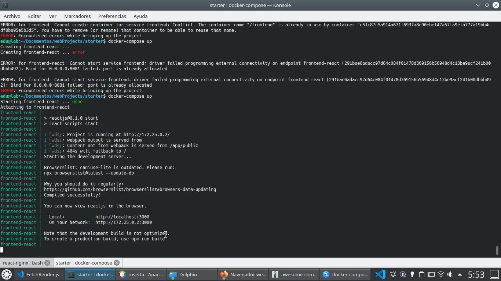

# react-nb-spring-mongo-starter
Docker development environment in separated containers. NetBeans/Vsc support is optional. However, it's recommended. This is a very simple configuration out-of-the-box, and it's inspired by some popular Docker images and builds, such as [awesome-compose](https://github.com/docker/awesome-compose), open-jdk:11, and mongoDB). I've compiled them in a single folder, with learning purposes. I thought that it could be useful for you to start coding a project fast, so I decided to share it.

***

## Prerequisites

* [Docker daemon and client](https://docs.docker.com/engine/install/ubuntu/) installed on dev machine, physically
* Linux 'shell' console, basic commands
* JDK to develop the backend outside the container, you'll need to install [Spring Boot packages](http://www.profesor-p.com/2018/08/27/instalar-plugin-spring-boot-con-netbeans-9-en-ubuntu-18-04/) (spanish guide), too.
* Code editor, better an IDE with JDK and JVM capabilities, NetBeans as in example for backend project, VSC could be a nice choice for both, backend and frontend (install Spring library)
* Basic knowledges about Javascript and Java languages, Html, Css and JSON 

## Configuration

* Download or clone this folder
* Open new shell allocated in ~/DownloadedFolder
* In the same folder level (where the file named 'docker-compose.yml' is stored), execute from shell the command:
` docker-compose up `
Then you'll read all logs in console about  the steps of building new images and setting up the three new containers in Docker. It may take some minutes, only the first time it was executed, be patience.

### Services described in docker-compose.yml

* **frontend**: According with file 'package.json' provided, React.js will be installed via 'npm install' command, so soon you´ll be noticed that your 'helloReact' is available from address 'http://localhost:3000'.
* **database**: Another container will be setup to start a MongoDB container, where to save your model.
* **backend**: Last, another container will be created to test the Spring built application, found in 'target/app-SNAPSHOT.jar'.

### Management

Once your environment will be installed and setup, you will be able to manage any of these containers by executing the command `docker-compose exec <name of service>` from the same folder level where 'docker-compose.yml' file is stored, in example: 
` docker-compose exec frontend bash `
Then you will access by bash console, so you'll be able to execute 'npm install' or other command to extend or to manage 'React' and 'Node' dependencies. Some packages would be very useful, such as 'Theme-ui', 'React-router-dom', 'i18next',... 

### Coding

* Frontend can be coded and compiled from './src' folder
* Backend can be coded and build from './nb-spring' folder.

Backend API can be tested visually from the address 'http://localhost:8080/api/books', or 'http://localhost:8080/api/publishings' (from you could fetch data responses), while your app in React.js will be served from the address 'http://localhost:3000'.

***
## Notes about configurations

### Backend open-jdk container run the Built .jar file, wich is found in 'nb-spring/target/springStart-0.0.1-SNAPSHOT.jar'

You have two option there. By default, the file 'app.jar' is served by the container named 'backend-spring' (not yet implemented). This container will run the target 'file.jar' built from the NetBeans project (target folder). But if you'll want to use your own Tomcat dev server (maybe from your IDE, most recommendable option while developing) you should disable this container to not cause duplicated assignment in ports. Then you can turn off this container typing `docker-compose stop backend`. Same result if you'ĺl stand up just the containers that you need instead, using `docker-compose up -d frontend database`. You can edit also the file 'docker-compose', to change the ports exposed, to delete or comment the lines related to this container).

***
## Bugs (latest on top)

* Some dependencies used by React.js need to be upgraded manually. I need to read more docs before crash nothing.
* Still having 2 moderate vulnerabilities in 'node', related with a package that manages regular expressions. This fix needs to replace other packages manually.
* (Fixed) Old versions of packages, due to 'node' and 'npm' versions.

## Previews

### Frontend installation

***

### Frontend view

